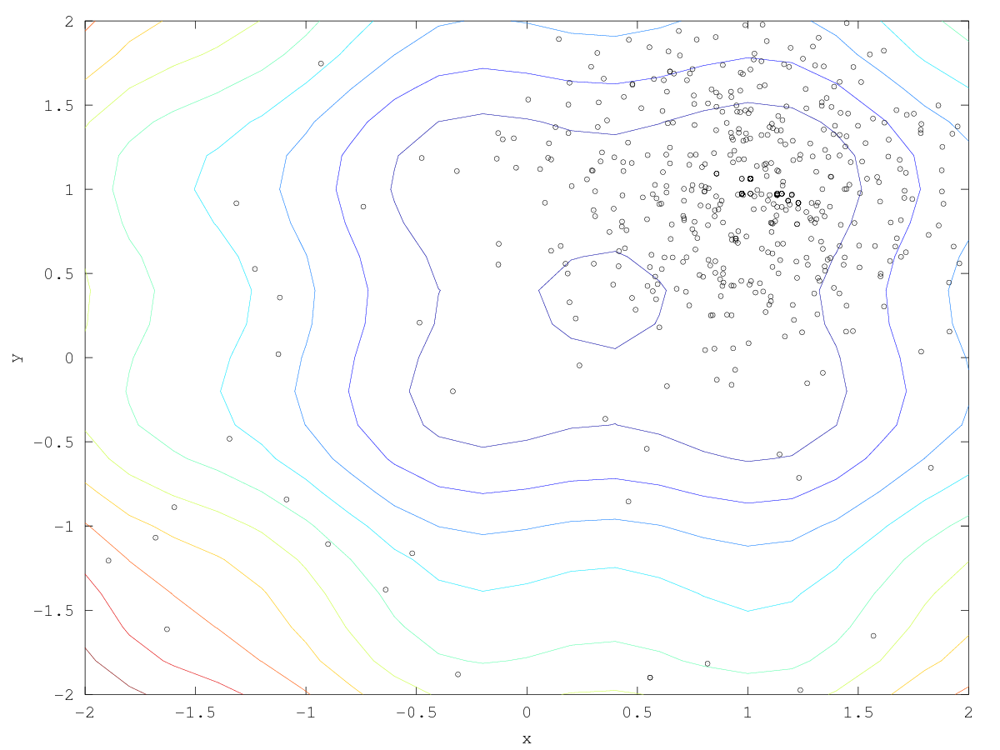

= EQ-SQL: EWEWS Queues: SQL implementation

This module supports EMEWS workflows in which the parameter queues are implemented in a SQL database.

See the tests directory and README for usage examples.

See the db directory and README for information about the database.

== Overview

The workflows run as normal Swift/T workflows, but the EQ functions are implemented with calls to SQL.

The call stack is:

* The Swift/T workflow (e.g., workflow.swift)
* The EQ module (EQ-SQL/swift/EQ.swift)
* The EQ Python code (EQ-SQL/python/eq.py)
* The EMEWS database tool abstraction (EQ-SQL/db/db_tools.py)
* The Python SQL API (the psycopg2 library)
* Postgres itself

== File index

swift/loop.swift::
A reusable workflow to consume tasks from EQ-SQL

swift/EQ.swift::
The Swift/T API functions to access EQ-SQL.  Import this into your workflow with `import EQ;` .  Calls into eq.py .

python/eq.py::
The Python code to access the DB via the API in db/db_tools.py .

== DEAP Example

See tests/test-swift-2 for this example.

=== Overview

This runs a real EA with http://deap.readthedocs.io/en/master[DEAP].  The objective function is simply:

_sin(4x) + sin(4y) - 2x + x² - 2y + y²_

== Run

Run with:

----
$ test/test-swift-2.sh
----

== Objective function

The objective function, +f()+ is expressed as:

Python: https://github.com/emews/mela/blob/master/deap/swift/workflow.swift[workflow.swift]

Tcl: https://github.com/emews/mela/blob/master/deap/Tcl/Tcl-Task/task.tcl[task.tcl]

For plotting in https://github.com/emews/EQ-Py/blob/master/examples/ga0/plots/f.m[f.m]
(see below for plotting information).

== Plot

. Simply generate +run.log+ as described above.
. Then use +create-xyz.tcl+ to create Octave-compatible vectors
. Then use +trajectory.m+ to make the plot

=== File index

In the +plots/+ directory:

==== Entry points

* +create-xyz.tcl+: Scans the Swift output and creates Octave-compatible data files {x,y,z}.dat .  These are the points sampled by DEAP. Usage:
+
----
cd plots
./create-xyz.tcl < run.log
----
+
* +trajectory.m+: Combines the contour plot with data points from {x,y,z}.dat.  Creates +plot.png+. Usage:
+
----
cd plots
octave trajectory.m
----

==== Supporting files

* +f.m+: The implementation of the objective function in Octave, used only for visualization
* +show_f.m+: Make a contour plot from +f.m+

=== Example output images

// align=center only works in HTML output, not on GitHub

. Run with σ = 0.5:
+

+
. Run with σ = 0.1:
+
image::plots/plot-s01.png[width=400,align="center"]
